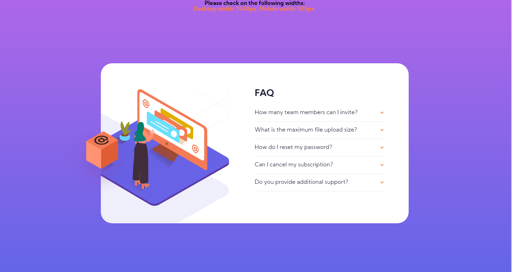
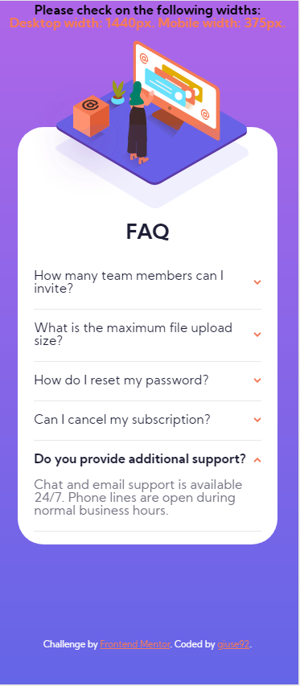

# Frontend Mentor - FAQ accordion card solution

This is a solution to the [FAQ accordion card challenge on Frontend Mentor](https://www.frontendmentor.io/challenges/faq-accordion-card-XlyjD0Oam). Frontend Mentor challenges help you improve your coding skills by building realistic projects.

## Layout

The designs were created to the following widths:

- Mobile: 375px
- Desktop: 1440px

## Overview

### The challenge

Users should be able to:

- View the optimal layout for the component depending on their device's screen size
- See hover states for all interactive elements on the page
- Hide/Show the answer to a question when the question is clicked

### Screenshot

### Links

- Live Site URL: [Live site URL here](https://giuse92.github.io/faq-accordion-card)

## My process

### Built with

- Semantic HTML5 markup
- CSS custom properties
- Positioning and Flexbox
- JS

### Continued development

Use this section to outline areas that you want to continue focusing on in future projects. These could be concepts you're still not completely comfortable with or techniques you found useful that you want to refine and perfect.

## Author

- Frontend Mentor - [@giuse92](https://www.frontendmentor.io/profile/giuse92)
